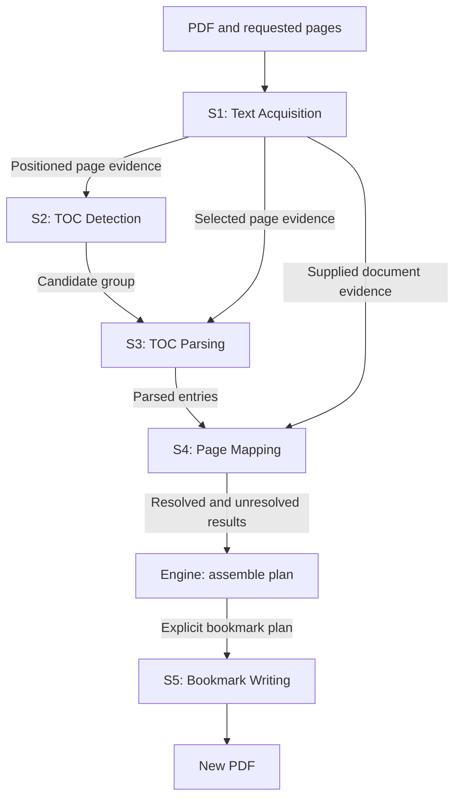

# PDF Bookmark: Architecture and Subsystem Implementation Guide

Agent edition 2.1 · 23 September 2026

**This is the complete implementation specification for agents. No human design document or earlier conversation is required.** It supersedes earlier agent editions. Edition 2.1 makes input preservation and replacement of ignored existing bookmarks explicit. Read the common architecture and contracts before implementing your assigned subsystem.

The project has **five domain subsystems**:

| ID | Subsystem | Question it answers |
| --- | --- | --- |
| **S1** | **Text Acquisition** | What readable, positioned text can we obtain from these PDF pages? |
| **S2** | **TOC Detection** | Which supplied pages appear to belong to a table of contents? |
| **S3** | **TOC Parsing** | What entries, printed references, and hierarchy does this TOC express? |
| **S4** | **Page Mapping** | Which physical PDF page does each parsed reference identify? |
| **S5** | **Bookmark Writing** | Can this explicit bookmark plan be written correctly to a new PDF? |

**Core is shared infrastructure. Engine is orchestration. CLI is a client. None is a sixth domain subsystem.** Internal helpers such as the renderer, OCR adapter, quality evaluator, and reference parser are components of their owning subsystem.

## Navigation and reading instructions

- [1. Project context and deliverables](#1-project-context-and-deliverables)
- [2. Overall architecture](#2-overall-architecture)
- [3. Common contracts and ownership](#3-common-contracts-and-ownership)
- [4. S1 — Text Acquisition](#4-s1--text-acquisition)
- [5. S2 — TOC Detection](#5-s2--toc-detection)
- [6. S3 — TOC Parsing](#6-s3--toc-parsing)
- [7. S4 — Page Mapping](#7-s4--page-mapping)
- [8. S5 — Bookmark Writing](#8-s5--bookmark-writing)
- [9. Engine orchestration](#9-engine-orchestration)
- [10. CLI, serialization, and distribution](#10-cli-serialization-and-distribution)
- [11. Assigning work to agents](#11-assigning-work-to-agents)
- [12. Implementation sequence and integration gates](#12-implementation-sequence-and-integration-gates)
- [13. Completion and deferred work](#13-completion-and-deferred-work)

Every implementing agent reads sections 1–3, its assigned charter, and sections 11–13. Read adjacent public contracts to understand handoffs. An agent implementing Engine or integrating the release reads the entire guide. Reading a neighboring contract does not authorize changing that subsystem's implementation.

Each charter defines mission, owned work, excluded work, public boundary, internal components, required behavior, acceptance, and handoff. A subsystem is an independent assignment and an independently usable library boundary; it is not merely a folder or one step of a script.

## 1. Project context and deliverables

### 1.1 Product goal

Build a C++ application and reusable libraries that add PDF outline bookmarks using a book's table of contents. Inputs may contain native text, scanned pages, unreliable embedded OCR layers, or mixed text and images.

The normal workflow is:

1. Read selected PDF pages and obtain positioned text.
2. Identify one or more plausible TOCs.
3. Parse entries while retaining source evidence and uncertainty.
4. Map printed references to physical PDF pages.
5. Produce an analysis report and an editable bookmark plan.
6. Validate the plan and write a new PDF.

Analysis does not modify the PDF. A client may inspect or correct the plan before applying it, or automate application when the plan is valid. Manual review is supported, not required for every run.

The initial release handles common book TOCs and supported numbering cases. Unrecognized layouts or uncertain page mappings must remain explicit. Incorrect bookmarks presented as confident success are unacceptable.

### 1.2 Existing OCR work: consume it as a dependency

The owner has already completed a C++ PaddleOCR model pipeline using **ONNX Runtime**. This project integrates that package; it does not implement OCR again.

Reported existing deliverables:

- C++ API: `include/ocr/ocr.hpp`.
- C ABI: `include/ocr/ocr.h`.
- Implementation: `src/engine.cpp`.
- Package documentation: `README.md` and `DECISIONS.md`.
- Golden parity runner: `tools/compare_golden.cpp`.
- Installed static and shared packages, standalone C and C++ consumers, and a demo that works from an unrelated working directory.

Reported baseline over 30 images: detector tensors/maps, DB boxes, crops, recognition tensors/logits, decoded text, and end-to-end boxes match the reference exactly; maximum confidence difference is `2.980232e-07`. The charset contains 18,708 tokens and no blank lines; recognition has 18,710 classes.

Treat these as owner-supplied baseline results. Inspect the real package before binding to its API, and record what you actually verify. Do not infer special-token semantics from class counts. Preserve its dictionary, preprocessing, box sorting, crop extraction, decoder, model resources, and parity tolerances.

S1 owns a small adapter to that package. Do not introduce Python, a new Paddle runtime, Tesseract, or a remote OCR service. Do not copy backend implementation into this project. A proven backend defect may justify a small separately recorded fix with the affected parity checks; ordinary integration does not.

### 1.3 Platform and development assumptions

- Primary workflow: Windows, Visual Studio, CMake, and existing dependency-management conventions such as vcpkg.
- Preserve the repository's working C++ standard and build conventions. Examples are interface sketches, not a requirement to adopt a new language version or error library.
- PDFium performs PDF reading, native text extraction, and rendering inside S1.
- qpdf performs PDF outline modification inside S5.
- The release goal is one self-contained executable per supported OS/architecture, including required model resources. Ordinary OS components may remain prerequisites. A static archive alone does not establish that the final application meets this goal.
- Verify Windows first. Do not claim other platforms have passed without running their checks.

### 1.4 Input preservation and existing-bookmark policy

**The original PDF stays byte-for-byte unchanged. All bookmark changes are written to a separate output PDF.** No option, including force/overwrite options, may enable in-place input modification. Existing bookmarks in the original remain intact.

**Ignore all existing PDF outline bookmarks during analysis, regardless of their apparent creator.** Do not use their titles, hierarchy or destinations as seeds, fallback results, corroborating evidence, or ground truth. Detect and parse the visible TOC pages using our own text/layout algorithms and resolve destinations from independently assessed document evidence. A printed TOC on a page is source content to analyze; the viewer's existing bookmark tree is not.

PDF defines document outlines and tagged-content `TOC`/`TOCI` structures, but those structures are not author-only or proof of accuracy. Editable author/producer metadata is not authentication. In v1, do not use TOC tags to import entries or bypass our detection/parsing. No automatic trusted-author exception is defined. Any future provenance-verification policy requires a separate design; a signature alone would not establish semantic correctness.

When applying a valid nonempty plan, **replace the output copy's existing outline with exactly the plan's tree**. Existing bookmarks do not block generation or trigger a replacement prompt. Do not merge or retain them in the output outline. Preserve page content and unrelated links/named destinations; replacing an outline is not deleting the printed TOC or every navigation object.

Represent this fixed initial behavior as `existing_outline_policy: "replace_in_copy"`. Refusing to overwrite an already existing output file remains a separate default. No valid generated plan means no successful bookmarked output; never fall back to the original outline.

## 2. Overall architecture

### 2.1 What “subsystem” means here

A subsystem has one coherent domain responsibility, a public contract, a designated owner, its own implementation and tests, and useful behavior outside Engine. Clients can call it directly.

A **component** is an internal implementation unit. S1's renderer may be implemented by a separate assigned agent, but remains part of S1 and does not become a separate domain subsystem.

A **contract** is a project-owned value or interface used across a boundary. It contains no PDFium, qpdf, ONNX Runtime, or OCR-package handle. Its owning subsystem defines its meaning; consumers must not create competing versions.

An **orchestrator** decides which subsystem to call, with what work, in what order. Engine owns orchestration for the complete application. S1 may coordinate its own extraction/render/OCR components to fulfill one acquisition request; that does not make it the application Engine.

### 2.2 Responsibility and dependency registry

| Area | Kind | Owns | Implementation dependencies |
| --- | --- | --- | --- |
| Core | Shared foundation | Common primitives, geometry, error and run-control conventions | Standard C++ and existing small utilities |
| S1 Text Acquisition | Domain subsystem | PDF session, native extraction, rendering, OCR adapter, source assessment/selection, neutral PDF facts | Core; private PDFium; private existing OCR package |
| S2 TOC Detection | Domain subsystem | Candidate recognition, scoring, grouping, continuation evidence | Core and S1 contract headers |
| S3 TOC Parsing | Domain subsystem | TOC rows, titles, literal references, reference syntax, hierarchy evidence | Core, S1 and S2 contract headers |
| S4 Page Mapping | Domain subsystem | Evidence interpretation, numbering associations, destination resolution, ambiguity | Core, S1 and S3 contract headers |
| S5 Bookmark Writing | Domain subsystem | Bookmark-plan contract, structural validation, PDF outline serialization, safe output commit | Core; private qpdf |
| Engine | Orchestration layer | Search schedule, budgets, evidence requests, candidate policy, analysis, plan assembly | Public APIs of S1–S5 |
| CLI | Client | Arguments, user-facing numbering, output/progress presentation, exit codes | Engine public facade |

**A contract-header dependency is not a runtime dependency.** S4 uses `TocEntry` without calling S3. S3 uses a candidate description without running S2. None of S2–S4 opens a PDF or invokes S1.

S5 consumes explicit destinations, so it does not depend on S4's mapping implementation. Engine translates mapping results into the plan contract owned by S5.

### 2.3 Data flow and control flow

This diagram shows **values passed between stages**, not permission for subsystems to call each other:



Engine makes the calls. It can ask S1 for more evidence when S2 reports a boundary continuation or S4 requests particular pages. Those subsystems return a need; they do not satisfy it themselves.

The Writer can also be used with a manually constructed plan, and Detection with synthetic positioned pages. Neither use requires the full workflow.

### 2.4 Logical targets and source ownership

Prefer one logical public library target per domain subsystem:

| ID/area | Target | Public headers | Owned implementation and tests |
| --- | --- | --- | --- |
| Core | `pdfbookmarkCore` | `include/pdfbookmark/core/` | `src/core/`, `tests/core/` |
| S1 | `pdfbookmarkText` | `include/pdfbookmark/text/` | `src/text/`, `tests/text/` |
| S2 | `pdfbookmarkTocDetection` | `include/pdfbookmark/detection/` | `src/detection/`, `tests/detection/` |
| S3 | `pdfbookmarkTocParsing` | `include/pdfbookmark/parsing/` | `src/parsing/`, `tests/parsing/` |
| S4 | `pdfbookmarkMapping` | `include/pdfbookmark/mapping/` | `src/mapping/`, `tests/mapping/` |
| S5 | `pdfbookmarkWriter` | `include/pdfbookmark/writer/` | `src/writer/`, `tests/writer/` |
| Engine | `pdfbookmarkEngine` | `include/pdfbookmark/engine/` | `src/engine/`, `tests/engine/` |
| CLI | `pdfbookmarkCli` | No required public C++ API | `apps/cli/`, `tests/cli/` |

These are logical paths. During discovery, map them to existing repository paths and record that map. Do not rename a working repository solely to reproduce this layout. If `pdfbookmarkToc` already exists, retain it as a compatibility/aggregate target if useful; Detection and Parsing must still have distinct public APIs, implementation ownership, and tests.

Keep value-only headers independently consumable. CMake INTERFACE targets may export them where needed. Do not make a Detection test link the Text implementation just to see `PageContent`. Do not create unused libraries or separate repositories for symmetry.

For static builds, private implementation dependencies may still be needed by the final linker. Export correct transitive requirements and verify installed consumers. “No backend in public headers” does not mean “no backend at final link.”

### 2.5 Ownership examples

| Behavior | Owner | Reason |
| --- | --- | --- |
| Choose the first 40 pages, then request 20 more | Engine | Document search strategy |
| Decide whether one requested page needs OCR | S1 | Acquisition quality/coverage policy |
| Convert PDF/image coordinates to the canonical frame | S1 | Normalize source evidence |
| Identify aligned title/reference patterns | S2 | Candidate recognition |
| Split a detected TOC row into title and `A-12` | S3 | Entry parsing and reference syntax |
| Infer whether `A-12` identifies an appendix page | S4 | Reference meaning and destination resolution |
| Identify a printed footer number in supplied regions | S4 | Mapping-specific interpretation |
| Read PDF page labels into neutral values | S1's PDF facts facade | Mechanical PDF reading |
| Choose between two candidate TOCs for this run | Engine | Application policy |
| Decide whether missing destinations may be omitted | Engine | Explicit partial-output policy |
| Check plan parents and cycles | S5 plan validator | Writable-plan invariant |
| Emit qpdf outline objects and commit a new file | S5 | PDF mutation |
| Convert CLI page `1` into library index `0` | CLI | Presentation boundary |

### 2.6 One entry through all five subsystems

This invented example illustrates the handoffs. It is not an expected result for a particular test PDF.

| Stage | Result | Boundary to notice |
| --- | --- | --- |
| S1 | On physical index 8, positioned regions contain `Transport ........ 12`; source and assessment are attached | S1 does not label the line a TOC entry |
| S2 | Candidate `toc-a` contains page index 8, supported by repeated aligned entry patterns | S2 identifies the candidate, not the destination |
| S3 | Entry `e7`: title `Transport`, literal reference `12`, decimal ordinal 12, known root, source regions on index 8 | The printed ordinal is still not a physical index |
| S4 | Supplied independent anchors in the same section support offset 11, with no conflicting checked evidence; `e7` resolves to index 23 | Mapping records its inference and assumptions |
| Engine | Create a plan node for `e7` with title `Transport`, no parent, and `pdf_page_index: 23` | Engine translates accepted results into the Writer's contract |
| S5 | Write that node to the 24th physical page and verify the reopened destination | S5 does not reinterpret the printed `12` |

If S4 has two equally plausible destinations, it returns Ambiguous. Engine records the issue or applies an explicit user decision; S5 never guesses which destination was intended.

## 3. Common contracts and ownership

### 3.1 Rules every subsystem must obey

1. **Physical PDF indices are zero based.** Counts are separate values. Library ranges are half open: `[first, end)`. CLI selections are one-based inclusive, converted exactly once.
2. **A printed reference is not an index.** `iv`, `12`, `A-12`, and a PDF viewer label remain distinct from a physical page index.
3. **Text is valid UTF-8.** Byte offsets, Unicode scalar counts, UTF-16 units, and PDF character indices are different units; name them explicitly.
4. **Geometry has one canonical frame.** Displayed crop, top-left origin, x right, y down, point dimensions accounting for physical scaling, rotation applied once. Unknown geometry remains unknown.
5. **Values own their data.** Returned results survive session/backend destruction. Borrowed input spans are valid only for the documented synchronous call.
6. **Unknown is not zero.** Missing confidence, hierarchy, destination, coverage, and geometry are explicit.
7. **Quality has several dimensions.** Readability, coverage, and OCR confidence must not collapse into one undocumented score.
8. **Evidence is traceable.** Retain source references, decision reasons, and configuration/policy identities.
9. **Expected failure is scoped.** Document/configuration errors, page outcomes, entry uncertainty, and backend attempts are different contracts.
10. **Input is immutable during a run.** Bind analysis/plans to analyzed input; detect changes and reject stale application.
11. **No backend types cross public boundaries.** Never expose PDFium handles, qpdf objects, ORT sessions, or installed OCR-package types.
12. **Subsystems never silently widen work.** S1 processes selected pages; S2–S4 inspect supplied evidence; S5 writes the given plan under explicit policies.
13. **Existing outlines are excluded from evidence.** Their presence, absence or content must not change detected/parsed/mapped semantic results for otherwise identical page content and non-outline evidence. Input digests and input-specific identities will differ.
14. **Write only a copy.** Applying a plan replaces the outline only in a separate output file; the original bytes and bookmarks remain unchanged.

Use the repository's suitable error convention. Sketches use `Result<T>`, `span`, and descriptive options to communicate semantics; they are not complete compilable headers. Do not require C++23 `std::expected` or upgrade solely for `std::span`.

### 3.2 Contract ownership ledger

| Contract | Definition owner | Meaning and consumers |
| --- | --- | --- |
| `PageIndex`, `PageCount`, `PageRange`, geometry, diagnostic/run-control primitives | Core | Shared units and conventions |
| `InputIdentity` | Core | SHA-256 and page count; optional path for display; S1/Engine produce and S5 verifies |
| `PageContent`, `TextRegion`, `PageAcquisition`, `AcquisitionBatch`, `SourceReference` | S1 contracts | Acquired text and provenance; S2–S4 consume |
| `PdfDocumentFacts`, `PdfPageFacts` | S1 contracts | Neutral metadata, viewer labels, supported local link facts; S4 consumes |
| `TocCandidate`, `DetectionResult` | S2 contracts | Candidate groups and detection evidence; Engine/S3 consume |
| `TocEntry`, `PrintedReference`, `Hierarchy`, `ParsedToc` | S3 contracts | Meaning expressed by the TOC; Engine/S4 consume |
| `DocumentEvidence`, `MappingOverride`, `EntryMapping`, `MappingResult`, `EvidenceRequest` | S4 contracts | Interpretation, resolution, alternatives and evidence needs; Engine consumes/assembles |
| `BookmarkNode`, `BookmarkPlan`, `PlanValidation`, `WriteResult` | S5 contracts | Explicit bookmark tree and write results; Engine/direct clients consume |
| `AnalysisOptions`, `AnalysisReport`, plan-building policies | Engine | Application decisions and completeness; CLI consumes |

Own each type once. Consumers use lightweight headers, not shadow models. Do not place all subsystem models in Core. Core contains no TOC heuristics, mapping rules, OCR policy, application JSON schemas, or PDF backends.

S5's `plan.hpp` and structural validator must be usable without qpdf headers/backend linkage. Implement structural validation as a lightweight unit reusable by Engine and S5; S5 remains its owner. Document-dependent validation runs again when applying a plan.

### 3.3 Evidence revision and document identity

`SourceReference` identifies an acquired page revision and region ID, plus an optional UTF-8 byte range at code-point boundaries. Region IDs are stable within a revision, not across changed models/policies. If Engine reacquires a page differently, assign a new revision and retain referenced evidence or rebuild dependent results. Never silently repoint references.

Final analysis/plan identity must describe bytes actually analyzed. A pre-run hash followed by unchecked mutable-file reads is insufficient. Use an immutable snapshot/handle strategy or equivalent verified read discipline and record it. Detect changes before accepting analysis and before committing output. Do not retain all page rasters to accomplish this.

### 3.4 Public operation summary

| Area | Operation sketch | Effects |
| --- | --- | --- |
| S1 | `open(path, options) -> Result<TextDocument>` | Read-only session |
| S1 | `document.acquire(pages, options, control) -> Result<AcquisitionBatch>` | Read/render/OCR selected pages |
| S1 | `document.read_facts(request) -> Result<PdfFactsResult>` | Read neutral metadata |
| S2 | `detect(page_evidence, options) -> Result<DetectionResult>` | Pure computation |
| S3 | `parse(candidate, page_evidence, options) -> Result<ParsedToc>` | Pure computation |
| S4 | `map(entries, evidence, overrides, options) -> Result<MappingResult>` | Pure computation; may request evidence |
| S5 | `validate(plan) -> PlanValidation` | Structural checks |
| S5 | `write_copy(input, output, plan, options, control) -> Result<WriteResult>` | Verify input and write new PDF |
| Engine | `analyze(input, options, control) -> Result<AnalysisReport>` | Coordinate S1–S4 and plan validation |
| Engine | `apply(input, output, plan, options, control) -> Result<WriteResult>` | Delegate to S5 |

“Pure” means no file/PDF access, OCR, network calls, or acquisition side effects. Require deterministic behavior for identical values/options; cancellation checks and diagnostic collection may be supported.

## 4. S1 — Text Acquisition

### 4.1 Mission

**Given a PDF session and explicitly requested pages, return the best usable positioned text obtainable under policy, with provenance, assessment, and honest per-page outcomes.** S1 is useful by itself to PDF text clients. Complete it first.

### 4.2 Owned work

- PDFium runtime lifetime, process-wide serialization, read-only sessions, and page selection validation.
- Native extraction, Unicode conversion, region geometry, and canonical coordinates.
- Readability/coverage evidence and source selection.
- Bounded rendering and image ownership.
- Private adapter to the completed OCR package, lazy initialization, and reuse.
- Per-page outcomes, attempt/candidate summaries, reasons, and deterministic flattening.
- A narrow PDF facts facade over the same session for page count/geometry, viewer labels, and supported local link destinations.

The facts facade is a supporting component, not another subsystem. It mechanically translates PDF data. It does not interpret printed footers, infer offsets, identify chapters, or inspect outlines for bookmark generation.

### 4.3 Excluded work

No TOC search, “first 40, next 20” schedule, chapter semantics, TOC parsing, printed numbering inference, bookmark destinations/plans, or PDF mutation. Never acquire unrequested pages to improve downstream analysis.

### 4.4 Public boundary

```cpp
class TextAcquisition {
public:
    Result<TextDocument> open(const Path&, const OpenOptions&);
};
class TextDocument { // move-only; retains required runtime ownership
public:
    PageCount page_count() const;
    Result<AcquisitionBatch> acquire(
        span<const PageIndex>, const AcquisitionOptions&, const RunControl&);
    Result<PdfFactsResult> read_facts(const PdfFactsRequest&);
};
```

A path-and-range convenience function may wrap a session. Engine uses a persistent session for repeated batches. A session may outlive its creating service.

| Value | Required content |
| --- | --- |
| `TextRegion` | Region ID, UTF-8 text, optional quad, actual backend granularity, optional OCR confidence |
| `PageContent` | Page index/revision, geometry/transforms, selected source, regions, reading-order status |
| `TextAssessment` | Readability, coverage, measured signals/reasons, policy version |
| `AcquisitionAttempt` | Stage, completed/failed/skipped state, reason, useful backend details |
| `PageAcquisition` | Index, outcome, optional selected content, assessment, attempt/candidate summaries |
| `AcquisitionBatch` | Request-ordered results, complete/cancelled state, configuration/model identity |
| `PdfFactsResult` | Requested facts with availability/error information; unsupported differs from absent |

Source is `EmbeddedPdf` or `Ocr`. Hidden OCR extracted from the PDF is `EmbeddedPdf`: this identifies retrieval, not authorship. No `Hybrid` in v1.

Validate duplicates and invalid indices before processing. Empty selections succeed. Preserve caller order; do not silently sort or clamp. Engine clamps its own requested ranges before submission.

### 4.5 Internal components

| Component | Responsibility | Must not decide |
| --- | --- | --- |
| PDF runtime/session support | RAII, locks, loading, neutral facts | TOC/mapping policy |
| Embedded extractor | Native text, geometry, mapping diagnostics | Whether to run OCR |
| Renderer | Bounded pixels and transforms | Which text source wins |
| OCR adapter | Invoke installed API; translate results | New preprocessing/decoding |
| Assessor | Readability and coverage signals | Next document pages to search |
| Acquisition controller | Policy, allowances, fallback, results | TOC/bookmark decisions |

Provide a fake OCR implementation at the real adapter seam for policy/failure tests. Other helpers may be concrete; do not abstract everything.

### 4.6 Required behavior

**Text and geometry.** Decode UTF-16 correctly, including surrogate pairs; do not assume PDFium strings are portable `wchar_t` arrays. Preserve punctuation, case, diacritics, dot leaders, meaningful gaps and native runs. Record invalid-sequence replacements. Dehyphenation/case folding belong in derived search text.

Record PDF-user-space, canonical-frame and raster transforms. Handle crop origins, rotation and user-unit physical scaling; transform quad corners. Determine whether OCR coordinates already refer to its original input image to avoid undoing resize twice. Test against the exact OCR raster.

Retain actual backend granularity; never invent word boxes or native confidence. Flatten with documented separators. Reading order can be `Estimated` or `Uncertain`. Avoid global y/x sorting that interleaves columns. Keep geometry for S2/S3 layout interpretation.

**Execution and ownership.** Serialize all PDFium calls process-wide, including different documents. Use synchronous acquisition and serialized OCR adapter calls initially. Do not infer wrapper safety from ORT; preserve validated backend internal threads. Close text-page/page/document resources in order. Results own their data.

Initialize OCR lazily and reuse it. EmbeddedOnly never initializes OCR. Release raster memory after OCR unless explicit diagnostics retain it.

**Rendering.** White background, configurable 300 DPI initially; evaluate 200/300 DPI later. Specify format, row orientation, dimensions, stride, extent and lifetime. Validate dimension/pixel/byte limits and overflow before allocation. Establish finite caps for the actual backend; report effective resolution if explicitly allowed to downscale.

Initially exclude annotations/form values unless a consistent extraction/rendering mode supports them. Hidden OCR remains eligible. Prefer memory buffers to temporary PNGs. Add no direct OpenCV dependency without a required operation; retain the OCR package's own dependencies.

**Options.** Use `Auto`, `EmbeddedOnly`, `OcrOnly`, not conflicting booleans. Include raster limits, per-call OCR-attempt allowance, diagnostics and cooperative run control. Engine maintains run-wide budgets across calls. Supported languages come from the model profile, not an arbitrary string.

**Assessment.** Readability is `Acceptable`, `Suspect`, or `Unknown`. Coverage is `NoOmissionIndicated`, `SuspectedIncomplete`, or `Unknown`. OCR confidence retains its documented backend meaning separately.

Signals include mapping/replacement/control problems, repetition/overlap, geometry, raster coverage and candidate disagreement where available. Measure decoded text appropriately, not UTF-8 bytes or English-only character classes. Missing signals remain unknown. Sparse text alone is not bad text; a large image is a verification signal, not proof of missing text.

| Policy/situation | Action |
| --- | --- |
| EmbeddedOnly | Native extraction/assessment only; no OCR initialization |
| OcrOnly | Render and OCR; missing backend is configuration failure |
| Auto, usable native and no specific omission signal | Select embedded |
| Auto, absent/unusable native | Attempt OCR within allowance |
| Auto, credible scanned-body/hidden-layer omission evidence | Attempt OCR verification within allowance |
| Both usable | Prefer embedded unless omission evidence favors OCR; material disagreement degrades the result |
| OCR fails, usable native remains | Degraded native with failed attempt recorded |
| Required OCR cannot run and no usable candidate remains | Failed, with unavailable/budget/resource reason |

Unknown coverage alone must not force OCR on every page. Do not compare unrelated scalar scores, concatenate whole candidates, or erase credible native content because OCR returned empty. Select one whole-page source in v1. Define versioned thresholds/disagreement rules and calibrate on fixtures; heuristic scores are not automatically probabilities.

**Outcomes.** `Ok`: usable without identified degradation under policy. `Degraded`: usable with unresolved issues. `NoTextFound`: applicable successful operations found no text, not certification of blankness. `Failed`: no usable candidate and required work failed/could not run. `Cancelled`: interrupted/unstarted work.

Open/request/configuration errors are top level. Page failures retain other successes. Budget exhaustion is not model failure. Cooperative cancellation preserves completed results and marks unstarted pages; document current-page handling without promising hard interruption of native calls.

### 4.7 Acceptance and handoff

Cover clean native, sparse valid, broken encoding, image-only, hidden OCR, native header plus scanned body, multilingual, rotated/cropped/scaled pages and relevant failures. Use the owner-mentioned TCP/IP PDF if available, verifying its physical indices before asserting “page 2” expectations.

Demonstrate:

- A standalone installed consumer acquires nonconsecutive pages without Engine.
- Results survive session closure; repeated batches reuse session/OCR resources.
- Identical bitmap input through adapter/direct OCR API produces equivalent outputs under existing tolerance.
- Pixel format, stride and geometry round trips match known expectations.
- Auto handles sparse/mixed pages and honest failure/cancellation/resource outcomes.
- EmbeddedOnly never initializes OCR and works in the optional build without OCR.
- Contract-only consumers require no backend headers/linkage.

Hand off API, tests/fixtures, actual commands, versioned policy, resource caps, package/model identities, unsupported facts/signals, and representative evidence usable by S2 without linking the backend.

## 5. S2 — TOC Detection

### 5.1 Mission

**Given acquired page evidence, identify and group plausible TOC pages.** S2 answers where a TOC might be, not what its final entries or destinations are.

This is a separate subsystem from Parsing. A client may want only TOC locations. Detection can finish and be independently tested before the parser exists.

### 5.2 Owned work

- Page-level TOC features: repeated title/reference patterns, alignments, leader patterns, heading cues and layout consistency.
- Candidate scores with documented meanings and evidence.
- Grouping adjacent compatible candidate pages and representing supported interruptions.
- Distinguishing multiple possible TOCs and signaling possible continuation outside supplied evidence.
- Clear treatment of degraded, missing and failed page evidence.

### 5.3 Excluded work

No file access, PDF handles, OCR, rendering, new-page acquisition, search scheduling, final entry parsing, hierarchy construction, page mapping, or bookmark plans. S2 must not call S1, S3, or Engine.

Recognizing a line as “title-like text followed by reference-like text” is a detection feature. Producing authoritative `TocEntry` records is S3's responsibility. Do not grow a second parser inside S2.

### 5.4 Public boundary

```cpp
Result<DetectionResult> detect(
    span<const PageAcquisition> supplied_pages,
    const DetectionOptions& options);
```

| Value | Required content |
| --- | --- |
| `TocCandidate` | Analysis-local candidate ID, ordered physical page indices and evidence revisions, score/reasons, start/end continuation state, gaps/limitations |
| `DetectionResult` | Zero or more distinct candidates, analyzed/skipped pages, diagnostics, detector policy identity |

Candidate pages are an explicit sequence, not only one inclusive start/end pair. A group can span pages while retaining an interruption or missing evidence. Do not silently fill gaps with pages never supplied.

Represent continuation separately on each boundary, for example `Closed`, `MayContinue`, `Unknown`. A boundary of the input batch is not evidence that a TOC ended. Engine decides whether to acquire neighbors.

Scores rank candidates under a documented policy; they are not automatically probabilities. Equal or close candidates remain distinct. Candidate IDs and ordering must be deterministic for the same evidence and options.

### 5.5 Internal components

| Component | Responsibility |
| --- | --- |
| Feature extractor | Inspect positioned regions and derive candidate cues |
| Page scorer | Evaluate competing positive/negative evidence |
| Candidate grouper | Group compatible pages without assuming missing pages are empty |
| Boundary assessor | Report continuation uncertainty at the supplied limits |

Lightweight lexical/layout helpers may be shared with S3 only through an explicitly owned, backend-free utility. Do not make Detection depend on the Parsing implementation or introduce a dependency cycle for code reuse.

### 5.6 Required behavior

Use text and geometry together. Do not require the literal English heading “Contents”; an OCR-damaged heading or later continuation page may lack it. Conversely, one heading or a few digits is insufficient evidence on its own. Consider index, glossary, body text, tables, and lists of figures as counterexamples or alternate candidate kinds where supported.

Do not treat missing acquisition content as empty text or proof of non-TOC. Retain why a page could not be assessed. A high score from a degraded acquisition still carries that provenance.

A multi-page TOC may start at physical index 39 and continue at 40. Given only index 39 at the batch end, return continuation uncertainty. Given the combined evidence, group consistently. Engine provides retained context; S2 does not remember an open document or privately fetch page 40.

Column-aware features must not depend on a flattened text stream having perfect reading order. Grouping may use repeated geometry patterns across consecutive pages. Do not merge all plausible pages in a document into one TOC or silently combine a brief TOC with a separate detailed TOC.

### 5.7 Acceptance and handoff

Pure-value fixtures must cover a single page, continuation without repeated heading, multiple candidate groups, two columns, batch-boundary continuation, missing/degraded pages, and non-TOC counterexamples. No PDF/OCR library may be required to run these tests.

Demonstrate a standalone consumer that supplies synthetic `PageAcquisition` values and obtains candidates. Include a real acquired TOC example, recorded candidate reasons, score semantics/thresholds, and limitations.

Hand off the candidate contract and fixtures to S3 and Engine. S3 must know exactly which supplied page revisions to parse. Engine must know which boundaries are unresolved. Completing S2 does not require choosing a final candidate for the application.

## 6. S3 — TOC Parsing

### 6.1 Mission

**Given a chosen candidate and its positioned page evidence, recover the TOC's entries, literal references, order, and hierarchy evidence.** S3 describes what the TOC says. It does not determine physical PDF destinations.

### 6.2 Owned work

- Layout interpretation within a candidate: columns, entry rows, wrapped titles, reference alignment and continuations.
- Title extraction and conservative cleanup of layout separators.
- Literal reference retention and syntactic parsing of decimal, Roman, prefixed and range forms.
- Explicit entry order and hierarchy inference with uncertainty.
- Traceability from entries and issues to source regions.

### 6.3 Excluded work

No document scanning, candidate search policy, PDF/OCR access, page-number offset inference, physical destination resolution, bookmark omission/promotion policy, or writing. S3 must not fetch missing candidate pages or reinterpret a printed `12` as PDF index `12`.

S3 can be used on a caller-specified candidate without running S2. Such a candidate must satisfy the same input contract.

### 6.4 Public boundary

```cpp
Result<ParsedToc> parse(
    const TocCandidate& candidate,
    span<const PageAcquisition> supplied_pages,
    const ParsingOptions& options);
```

| Value | Required content |
| --- | --- |
| `PrintedReference` | Original literal; optional syntax interpretation: numbering style, prefix, ordinal and range end; parse uncertainty |
| `Hierarchy` | `Root`, `KnownParent(entry_id)`, or `Unknown`, with evidence/reasons |
| `TocEntry` | Stable analysis-local ID, title, order, optional printed reference, hierarchy, source references and diagnostics |
| `ParsedToc` | Candidate identity, ordered entries, unparsed/ambiguous source fragments, completeness, parser policy identity |

“No printed reference” is a valid state, for example a section-heading row. It is not page zero. Preserve the original reference even when syntax parsing succeeds. `iv`, `IV`, `12`, `A-12`, and `12–15` may normalize into structured syntax, but their exact source remains inspectable.

Syntactic interpretation does not establish numbering-section identity. Recognizing Roman `iv` as ordinal 4 belongs here; proving which PDF page that ordinal identifies belongs to S4.

### 6.5 Internal components

| Component | Responsibility |
| --- | --- |
| Layout/row assembler | Form entry candidates from regions, columns and wrapped lines |
| Title/reference parser | Separate fields without losing meaningful title content |
| Hierarchy inferer | Use indentation/numbering/style evidence to propose parents |
| Provenance assembler | Preserve source references, ordering and unresolved fragments |

Do not require semantic layout models or GLiNER. Start with geometry and explicit text patterns; use available evidence without inventing unavailable font/style metadata.

### 6.6 Required behavior

Parse columns independently before establishing final entry order. Preserve a wrapped title across source regions and across a page boundary only when evidence supports continuation. Remove dot leaders as layout separators without globally stripping dots or numbers from titles.

Handle titles that contain numbers, references that are absent, duplicate titles, and repeated printed labels. Entry identity comes from source/order, not title uniqueness. Do not silently drop rows that the parser cannot understand; retain their fragments and issues in `ParsedToc`.

Hierarchy must distinguish a known root from unknown parentage. A numerical `level` alone is insufficient because it hides uncertainty. Never invent a parent solely to make a tree complete. Engine can later apply an explicit flat-outline policy; that is not an implicit parser fallback.

Validate candidate evidence revisions and available pages. Missing content yields an explicit incomplete parse or request-level mismatch error as appropriate, never acquisition side effects. Incomplete candidate boundaries must remain visible in parse completeness.

### 6.7 Acceptance and handoff

Pure fixtures must cover single/multiple columns, wrapped titles, numeric titles, leader dots, missing references, Roman/prefixed/range references, duplicate titles, clear hierarchy, ambiguous hierarchy, and unsupported fragments. Assert source provenance as well as extracted text.

Demonstrate a standalone parse call using only candidate and page values. It must not open a PDF or require S2's runtime. Include a real TOC example with inspectable title/reference/parent decisions.

Hand off entries, unresolved fragments, interpretation rules, supported patterns, and fixture expectations to S4 and Engine. A successful parse can contain entries that S4 cannot yet map; do not hide that distinction.

## 7. S4 — Page Mapping

### 7.1 Mission

**Given TOC entries and supplied document evidence, resolve their printed references to physical PDF page indices, or explain why resolution is ambiguous or unavailable.**

### 7.2 Owned work

- Interpret supplied page text as mapping evidence: printed page-number observations and heading matches.
- Associate printed references with numbering sections, PDF viewer labels and supported local link destinations.
- Apply explicit page/offset overrides and infer supported simple offsets from adequate evidence.
- Resolve destinations, retain alternatives/conflicts, and request additional evidence when useful.
- Validate destination bounds and record the method supporting each result.

### 7.3 Excluded work

No PDF opening, OCR, rendering, direct S1 calls, search-budget ownership, TOC entry reconstruction, final bookmark hierarchy edits, or writing. S4 does not decide that the application should omit an unresolved entry.

Extracting the text `A-12` from an already supplied footer region is S4 evidence interpretation. Extracting characters from a PDF object is S1 work. This distinction prevents PDF access from leaking into Mapping.

### 7.4 Public boundary

```cpp
Result<MappingResult> map(
    span<const TocEntry> entries,
    const DocumentEvidence& evidence,
    span<const MappingOverride> overrides,
    const MappingOptions& options);
```

| Value | Required content |
| --- | --- |
| `DocumentEvidence` | Input identity/count; supplied page evidence/revisions; available PDF label/link facts; evidence coverage and limitations |
| `MappingOverride` | Explicit entry destination or section-scoped offset, origin and scope |
| `EntryMapping` | Entry ID; `Resolved`, `Ambiguous`, or `Unresolved`; optional destination; method/reasons; alternatives and supporting evidence |
| `EvidenceRequest` | Requested physical indices or bounded range, purpose, priority, stable request identity |
| `MappingResult` | Entry results in input order, derived observations, evidence requests, diagnostics and policy identity |

Evidence requests are data returned to Engine. They do not contain backend callbacks or execute acquisition. If a useful bounded request cannot be identified, remain unresolved rather than asking to scan indefinitely.

### 7.5 Internal components

| Component | Responsibility |
| --- | --- |
| Evidence interpreter | Derive printed-number/heading observations from supplied regions |
| Reference associator | Compare label, prefix, section and direct-link evidence |
| Resolver | Apply overrides and supported inference rules |
| Consistency checker | Detect collisions, contradictions, discontinuities and bounds errors |
| Evidence-request planner | Describe the next useful bounded observation |

These components are algorithmic and backend-free. Numbering-section identity is a mapping concept, not a new document-understanding subsystem.

### 7.6 Required behavior

Keep physical index, viewer label and printed reference separate. Viewer labels are evidence; they can be missing, repeated, or unrelated to the visible printed numbering. A repeated label without section evidence is ambiguous. Page-local links and labels are untrusted hints requiring corroboration against acquired page content, not author-certified truth. A local link is useful only when its source association and destination are valid; external actions are not local page evidence. Never obtain mapping evidence from existing outline items or their destinations.

For arithmetic offsets define exactly:

```text
pdf_index = printed_ordinal + offset
printed ordinal 1 at physical PDF index 12 implies offset 11
```

Scope offsets to a known numbering section. Validate arithmetic and bounds before converting to backend integers. Do not clamp an invalid destination to the nearest valid page.

Inferred simple offsets require at least two independent agreeing anchors in the same numbering section, with no contradictory checked evidence. Two observations of the same page, including native/OCR versions, are not two independent anchors. This is an operational minimum, not proof that every intervening page is sequential; check representative targets and report observed discontinuities.

Use exact section evidence or explicit user settings for Roman front matter, repeated numbering and appendix prefixes. Preserve range syntax; use its start for a page-level bookmark only when that interpretation is valid and resolves. Do not implement general automatic segmentation of every possible restart or inserted-page pattern in v1. Unsupported situations stay unresolved.

Record manual decisions separately from inference. Explicit per-entry destination overrides take precedence when valid and deliberately supplied; preserve contradictory evidence as a diagnostic. Reject malformed or mutually incompatible overrides instead of silently choosing one. Do not relabel a manual choice as an automatically verified match.

Every Resolved result has an in-range destination and a stated method/evidence or explicit override. A ranking score alone does not establish resolution. Ambiguous results retain plausible alternatives; Unresolved results state what is missing. Neither contains a pretend destination such as index zero.

### 7.7 Acceptance and handoff

Pure fixtures must cover the offset equation, explicit overrides, insufficient anchors, contradictory anchors, Roman sections, repeated labels, appendix prefixes, ranges, missing references, absent targets, out-of-range arithmetic and inserted-page conflicts. Verify that requests are bounded and repeated calls with unchanged evidence are deterministic.

Demonstrate a standalone mapping consumer using entries and manually supplied facts, without PDFium, qpdf, OCR or parser runtime linkage.

Hand off methods/assumptions, resolved/ambiguous/unresolved fixtures, evidence-request semantics, limitations, and supported override forms. Engine must be able to build a plan from resolved results and explain every unresolved entry without guessing.

## 8. S5 — Bookmark Writing

### 8.1 Mission

**Validate an explicit, input-bound bookmark plan and write its tree to a new PDF, preserving the input and verifying the output before committing it.** S5 accepts manually built plans as well as Engine-generated plans.

### 8.2 Owned work

- Public plan/node/destination models and backend-free structural validation.
- Input identity and page-count checks at application time.
- qpdf integration, Unicode titles, local page destinations and outline-tree construction.
- Replacement of the outline in the output copy, protected-input checks and output-file replacement policy enforcement.
- Temporary output, reopen verification, final commit, cleanup and write diagnostics.

### 8.3 Excluded work

No text acquisition, TOC detection/parsing, printed reference interpretation, page-offset inference, entry omission/promotion decisions, or selection of a better destination. A bad plan is rejected; S5 does not “repair” it by making semantic guesses.

### 8.4 Public boundary

```cpp
PlanValidation validate(const BookmarkPlan& plan);

Result<WriteResult> write_copy(
    const Path& input, const Path& output,
    const BookmarkPlan& plan,
    const WriteOptions& options,
    const RunControl& control);
```

| Value | Required content |
| --- | --- |
| `BookmarkNode` | Unique ID, optional parent ID, nonempty UTF-8 title, physical page destination |
| `BookmarkPlan` | Schema/index convention, input identity/count, ordered nodes, existing-outline policy, recorded omissions/promotions |
| `PlanValidation` | Valid/invalid plus structured issues tied to nodes/fields |
| `WriteResult` | Output identity/location, committed state, verification summary and diagnostics |

Node array order determines sibling order. Parent IDs define hierarchy. Repeated destinations are valid; duplicate IDs, missing parents and cycles are not. A title may be edited without changing node identity.

Structural validation is reusable without opening a PDF. Application must still validate the actual input and plan; an earlier validation result is not authority to skip current checks. Plan-file JSON encoding belongs to Engine's codec, which must implement this S5-owned schema faithfully.

### 8.5 Internal components

| Component | Responsibility |
| --- | --- |
| Plan validator | Schema/model invariants, tree structure, bounds against declared count |
| Input verifier | Actual identity/count, alias and protected-input checks |
| qpdf outline adapter | Serialize titles, page references, parents/siblings/counts |
| Output transaction | Temporary sibling, close/reopen verification, commit and cleanup |

Keep the structural validator separate from qpdf-dependent code. Use the pinned package's actual exported CMake target; confirm it rather than hardcoding undocumented library paths.

### 8.6 Required behavior

Verify plan version/index convention, digest/count, IDs, titles, parents/cycles, sibling order and destination bounds. Reject an empty writable plan rather than unintentionally deleting the outline. A future explicit outline-removal operation is outside v1.

Reject equivalent input/output files, including detectable path aliases/hard links. Preserve the original input byte-for-byte; no overwrite option may bypass this rule. Always install exactly the supplied plan's tree in the output copy, replacing any existing outline there under `replace_in_copy`. Do not refuse or prompt merely because the input has bookmarks. Never merge or preserve old entries in the output outline. Default to refusing an already existing output file; explicit output-file replacement is a separate option and can never target the input.

Initial writing rejects encrypted and signed PDFs with an explicit unsupported result. Analysis may read an encrypted file with credentials when supported, but that does not authorize decryption or signature invalidation during writing.

Use page-level local destinations initially. Construct correct outline parent/sibling links and count semantics using qpdf's supported object APIs. Preserve unrelated document content/structures to the supported extent and document limitations; do not promise byte-identical rewritten output.

Write a temporary sibling, close it, reopen it, verify page count, complete outline hierarchy/order/titles/destinations, then commit. Use appropriate no-clobber or explicit replacement operations for the platform. A failure before commit must leave the requested destination and original input intact. Do not expose a half-written final output.

Cancellation before commit aborts cleanly. Once commit succeeds, report a committed result even if cancellation arrives immediately afterward; do not misreport a completed file as if no output exists.

### 8.7 Acceptance and handoff

Test valid trees, Unicode titles, repeated destinations, missing parents/cycles, bounds, empty plans, stale digests, input/output aliases, existing outlines, output collisions and protected inputs. With preexisting user bookmarks, verify that the new copy contains exactly the plan's outline and the original retains its original bytes/bookmarks. Compare input SHA-256 before and after successful, failed and cancelled operations. Inject write/verification failures and verify original/requested output preservation. Reject input aliases even when output overwrite is enabled.

A standalone consumer must write a PDF from a manually constructed plan without S1–S4. Reopen output to inspect structure and destinations, compare page count and representative content, and inspect sample bookmarks in a viewer when available.

Hand off the plan contract/validator, supported write options, verified failure behavior, sample output, actual qpdf/build identities and consumer commands. Correct outline serialization does not prove that S4 selected the right chapter page; that is a separate integration check.

## 9. Engine orchestration

### 9.1 Role and boundary

Engine is the application coordinator. It owns **which work to perform and when**, while S1–S5 own how their domain operations work. A thin engine can contain substantial policy and error handling; “thin” does not mean one untestable function containing every algorithm.

Engine owns:

- One analysis session, configuration and run-wide budgets/cancellation.
- Acquisition search batches and retained neighboring evidence.
- Invocation of Detection/Parsing/Mapping and bounded follow-up requests.
- Candidate choice under explicit policy and reporting of alternatives.
- Report aggregation, completeness and stop reasons.
- Plan assembly, manual corrections, optional omission/promotion/flattening policy.
- JSON codecs and a public facade for CLI text/analyze/apply operations.

Engine does not own quality formulas, OCR preprocessing, TOC recognition/parsing heuristics, offset inference, qpdf objects or PDF output transaction mechanics. Move existing such code from a growing `inspect_file()` into its assigned subsystem in small verified changes.

### 9.2 Analysis sequence

1. Validate application options and establish the immutable input identity/session through S1.
2. Acquire the first search batch through S1 and retain page outcomes/revisions. Do not load existing outline entries into analysis or skip analysis because bookmarks already exist.
3. Run S2 over relevant accumulated evidence. Extend the search or a candidate boundary within budgets.
4. Preserve distinct candidates. Choose one under documented policy, or report that explicit selection is needed when evidence is insufficient.
5. Pass the chosen candidate and its page evidence to S3. Retain partial parse issues.
6. Assemble S4's `DocumentEvidence` from S1's facts and acquired pages; supply explicit user overrides where present.
7. Call S4. Fulfill useful new bounded evidence requests through S1, then call S4 again. Stop on completion, budget exhaustion, cancellation, or no new information.
8. Assemble a `BookmarkPlan` from parsed hierarchy and resolved destinations under explicit plan policies. Call S5's structural validator.
9. Return the analysis report, and a ready plan only when the plan-generation requirements pass. No PDF mutation occurs.

### 9.3 Search, budgets, and completeness

Initially search the first 40 physical pages, then batches of 20, clamped to document length. Before implementation passes integration, choose and record finite configurable defaults for total search pages, additional evidence pages, OCR attempts, and repeated-request limits. Do not leave unlimited scans/retries as an accidental default.

S1 enforces the allowance supplied to an acquisition call; Engine debits actual attempts/work against the run-wide budget and passes the remainder on subsequent calls. A budget consumed in one batch does not reset in the next.

Retain boundary context so a TOC spanning indices 39/40 remains a single assessable candidate. Do not discard page 39 when acquiring 40–59. Distinguish a candidate known to end from a boundary that could not be checked.

Deduplicate repeated evidence requests using input, page and configuration identity. Do not loop if the same request cannot yield new information. A bounded in-session cache is optional if repeat requests justify it; persistent caching is deferred.

Keep search completeness separate from result readiness. Outcomes include `NoTocFoundInSearch`, `SearchIncomplete`, `AnalysisPartial`, `PlanReady`, `Cancelled`, and `Failed`. A search of 40 pages is not proof that no TOC exists anywhere. Acquisition failures and exhausted budgets remain visible. A plan from a fully assessed chosen candidate can be ready even if unrelated document pages were never searched.

### 9.4 Plan assembly policy

Default readiness requires the selected TOC's required entries and hierarchy to resolve, with candidate/parse incompleteness handled explicitly. Do not label a partial parse a complete automatic plan by ignoring unresolved fragments.

An explicit partial-output policy may omit unresolved destinations. Preserve every source entry in the analysis, record omissions, and promote resolved descendants to their nearest retained ancestor when their original ancestry is known. Record each promotion. If no retained ancestor exists, promotion to root must be explicit in that policy. Unknown ancestry cannot be repaired by this rule.

Unknown hierarchy requires a correction or explicit flat-outline policy. Do not silently flatten. A partial plan must retain the report's incompleteness and deliberate omissions even when its remaining tree is structurally writable. If no nodes remain, report that condition and do not apply an empty replacement outline.

Manual title, parent and destination edits are supported in the plan, with validation. They do not rewrite original extracted evidence. Default noninteractive automation uses supplied options and validated plans; do not add routine permission prompts.

### 9.5 Engine acceptance

Verify the 39/40 boundary, multiple candidates, finite budgets, no-progress requests, partial acquisition, unresolved mapping, unknown hierarchy, explicit partial output, input change and cancellation. Assert which subsystem was called and why where orchestration errors are the risk; do not retest every subsystem algorithm through mocks.

End-to-end tests must separately verify correct chapter destinations and correct written outline structure. OCR parity, good TOC detection and a syntactically valid PDF are individually insufficient to prove the complete result.

Use paired PDFs with identical page content and non-outline evidence but different or absent outline trees. Detected candidates, parsed entries, mapping decisions and generated node semantics must agree after normalizing input-specific identities. Deliberately misleading existing bookmarks must not affect the result. If the visible TOC cannot be found or resolved, retain that outcome rather than reuse old bookmarks.

## 10. CLI, serialization, and distribution

### 10.1 Client behavior

Provide these logical operations, retaining compatible established command names if they already exist:

```text
pdfbookmark text input.pdf --pages 1-40 --json text.json
pdfbookmark analyze input.pdf --report analysis.json --plan plan.json
pdfbookmark apply input.pdf --plan plan.json --output bookmarked.pdf
```

These are target behavior examples, not claims that commands already exist. CLI page selections are one-based inclusive; library/JSON indices are zero based. Support arbitrary selected pages through a documented syntax when exposing S1's selection API.

CLI contains argument parsing and presentation. It calls Engine's facade; advanced C++ clients may call any subsystem directly. Avoid two independent application pipelines in CLI and Engine.

Keep JSON/stdout clean and progress on stderr. Define exit behavior for complete, partial/unresolved, failed and cancelled work. Never hide omissions or partial analysis behind ordinary success messaging. Do not require interactive prompts where explicit options already provide the decision.

### 10.2 Serialization contracts

Use UTF-8 JSON, `schema_version: 1`, explicit `page_index_base: 0`, deterministic ordering, strict member/type validation and checked numeric conversion. Reject unsupported schema versions. Reuse an existing suitable JSON dependency rather than introducing an unnecessary second one.

Analysis JSON includes input identity, acquisition/configuration/model identities, page outcomes and available source evidence, searched/evidence pages, completeness and stop reasons, candidates, parsed entries/fragments, mapping decisions/alternatives, diagnostics and plan-generation choices. A detailed report must retain or reference enough versioned evidence to interpret its source references; do not serialize unusable region IDs alone.

Plan JSON has at least this shape:

```json
{
  "schema_version": 1,
  "page_index_base": 0,
  "input": {
    "sha256": "<computed SHA-256 of the analyzed input>",
    "page_count": 100
  },
  "existing_outline_policy": "replace_in_copy",
  "nodes": [
    {
      "id": "entry-1",
      "parent_id": null,
      "title": "Introduction",
      "destination": { "pdf_page_index": 12 }
    }
  ],
  "omitted_entries": [],
  "promotions": []
}
```

This is illustrative, not a valid identity for a real PDF. Populate the digest/count from the actual input. S5 owns plan semantics; Engine owns encoding/decoding. Neither may silently extend the format independently. Structural validation can run before PDF access; S5 rechecks actual identity/count at apply time.

Analyze writes a ready plan only when readiness requirements pass. If useful to export an incomplete draft, give it an explicit draft status distinct from the writable plan contract; never produce a file the normal apply path can mistake for a valid ready plan.

### 10.3 Packaging and deployment target

Preserve the working OCR static/shared packages and install exports. Link them correctly into the application without assuming undocumented archive names. Verify public library consumers after install, not only inside the source tree.

For the self-contained executable, include required models/dictionary/resources, preserving any existing embedding mechanism. Do not mistake successful static-library linkage or execution from another directory for a complete dependency audit. Check on a clean environment with only the intended executable and input, without accidental model/DLL resolution from the build directory or PATH.

Record compiler, architecture, runtime linkage, dependency/model versions, resource inventory and notices. Verify Windows first. Other platforms are Unverified until their actual environment passes. Missing packaging capability is a recorded incomplete requirement, not grounds to silently redefine “single executable.”

## 11. Assigning work to agents

### 11.1 Assignment modes

This guide supports both one agent working sequentially and explicitly assigned agents working on separate subsystems. The architecture does not change with the number of agents.

- **One agent:** perform the sequence in section 12, maintain one active implementation step, and take each ownership role in turn.
- **Several assigned agents:** establish shared contracts first, assign subsystem IDs and file ownership explicitly, then implement against those contracts using fixtures/stubs where dependencies are not yet available.
- **Two agents within one subsystem:** split internal component/file ownership, appoint one subsystem owner for its public API and integration, and retain one acceptance gate for that subsystem.

Do not spawn or delegate to additional agents without explicit authorization. A hypothetical assignment example here is not automatic permission. Runtime backend threads and build parallelism are unrelated to the number of implementing agents.

### 11.2 Shared integration ownership

Designate one integration owner when several agents are active. This is a role, not another subsystem or a requirement for a permanently separate agent. In serial mode the same agent holds it.

The integration owner coordinates Core, the contract ledger, root CMake/install exports, dependency versions, shared schemas/fixtures, Engine/CLI integration and release gates. Subsystem owners control their own public contract meaning and implementation.

Before independent implementation, record actual file ownership. Each agent edits only assigned paths. Root build files and shared headers have one active editor. Subsystem-local build files can belong to their subsystem owner. Use isolated worktrees when appropriate; do not overwrite another agent's changes in a shared checkout.

If an interface needs to change:

1. Describe the concrete missing capability and affected producer/consumers.
2. Have the contract owner and integration owner settle one compatible contract change.
3. Update the canonical header/schema, contract fixture and consumers together or through an agreed compatibility step.
4. Re-run affected gates and record the decision.

Do not duplicate a type, add a hidden backend dependency, or reach into another subsystem's private headers to bypass coordination. This is coordination between assigned owners, not a request for human approval on routine implementation details. Escalate only actual scope/requirement conflicts or missing access/artifacts.

### 11.3 Ready-to-use subsystem assignment prompt

Replace bracketed fields and provide this guide plus repository access. No human report is needed.

```text
Implement subsystem [S1/S2/S3/S4/S5] from
pdfbookmark-agent-implementation-guide.md, agent edition 2.1.

Read sections 1–3, your subsystem charter, and sections 11–13.
Read the adjacent public contracts needed for your handoffs.
The charter defines your responsibilities, exclusions, and acceptance gate.

Assigned implementation/test paths: [actual paths].
Public-contract owner: [owner].
Integration owner: [owner or yourself in serial mode].
Shared contract baseline: [commit/revision].
Current progress and next action: [record location].

Implement and verify this subsystem as an independently usable library.
Use agreed contract fixtures when another subsystem is unavailable.
Preserve the completed OCR package and unrelated changes.
Do not implement neighboring subsystems or change shared contracts silently.
Do not spawn other agents unless explicitly authorized.

Deliver code, public contract documentation, focused verification evidence,
an independent consumer example, known limitations, and a handoff record.
Proceed through ordinary implementation decisions without routine approval.
```

### 11.4 Optional two-agent splits inside a subsystem

These are assignment suggestions, not new subsystem definitions. Establish exact filenames before work starts; component tests belong to the agent implementing that component, while the subsystem owner owns cross-component tests.

| Subsystem | Agent A: subsystem owner | Agent B: bounded component assignment | Shared seam agreed first |
| --- | --- | --- | --- |
| S1 Text | Session/runtime, native extraction, neutral facts, acquisition controller and assessment | Renderer and adapter to the existing OCR package | Image lifetime/format, transforms, OCR candidate/attempt result |
| S2 Detection | Page features/scoring and public detection facade | Candidate grouping and continuation assessment | Page-level feature/score result and group input |
| S3 Parsing | Layout/row assembly, title/reference parsing, public facade | Hierarchy inference and hierarchy fixtures | Ordered parsed-row evidence with source IDs |
| S4 Mapping | Evidence interpretation, overrides and public facade | Offset/association resolution and consistency checks | Numbering observations, section/override and resolution records |
| S5 Writer | Plan contract/validator, input verification, public facade | qpdf outline adapter and output transaction | Validated node tree, input access and commit/verification result |

Agent B does not edit Agent A's public headers or shared runtime implementation without coordination. For S1, the renderer uses the owner's established PDFium runtime/locking support; it must not create a competing runtime or lock. For S5, agree who opens/owns the qpdf document so validation and serialization use the same verified input.

Two agents should not both implement the complete subsystem and later choose a winner. Assign complementary components or an explicitly requested review role.

### 11.5 Common handoff record

Each subsystem delivers a short record with:

```text
Subsystem ID and guide version:
Owner and owned paths:
Contract/header/schema revision:
Implemented public operations:
Supported behavior and explicit limitations:
Configure/build/test commands and actual results:
Independent consumer example:
Fixtures and expected outputs:
Changes required from adjacent owners, if any:
Remaining blockers or next integration action:
```

An API header without tested behavior is not a completed subsystem. A working demo dependent on private headers is not an independent public consumer. Stubs can unblock another agent's implementation but do not count as final integration evidence.

## 12. Implementation sequence and integration gates

### 12.1 Baseline discovery

Before implementation, read applicable `AGENTS.md`, inspect the worktree and existing docs/build/tests, preserve unrelated changes, and map logical subsystem paths to the real repository.

Locate the existing OCR package, public headers, README, DECISIONS, installed targets, model resources and golden-runner usage. Record actual APIs for pixels, boxes, ownership, errors, lifetime and concurrency. Identify existing PDFium/qpdf/JSON/hash integrations and avoid duplicate dependencies.

Run the working build and relevant OCR consumer/baseline check. Do not invent a pass for missing corpora or absent platforms. Record exactly what is available, what was verified, and any required missing artifact. Missing OCR assets are not permission to replace the backend.

### 12.2 Contract baseline before separate assignments

Establish Core units/error conventions and lightweight public model headers for S1–S5. Define ownership, semantics, representative values and minimal compile/contract fixtures before agents separately implement producers and consumers. Do not build speculative frameworks or every possible future option.

The contract baseline must let a Detection/Parsing/Mapping consumer compile without native backends, and a Writer plan consumer compile without qpdf headers. It must settle page numbering, geometry, evidence revision, uncertainty and plan-tree rules.

In serial work, this can be incremental, but settle each handoff before writing both sides. In multi-agent work, publish the agreed contract revision and name the active editor of each shared file.

### 12.3 Recommended serial order

| Step | Work | Gate before proceeding |
| --- | --- | --- |
| A0 | Repository/OCR baseline | Existing functionality and actual dependency contracts recorded |
| A1 | Common contracts and target ownership | Lightweight consumers compile; units/lifetimes/uncertainty unambiguous |
| A2 | S1 native session/extraction | Owned UTF-8 positioned evidence, geometry and resource lifetime verified |
| A3 | S1 rendering/existing OCR adapter | Identical-bitmap adapter parity, bounded raster handling, OcrOnly verified |
| A4 | S1 Auto/diagnostics/failure policy | Full S1 acceptance passes; standalone installed Text consumer works |
| A5 | Migrate old engine text code; expose text CLI | One session-based implementation serves existing and independent clients |
| A6 | S2 Detection | Candidate/group/boundary fixtures and independent consumer pass |
| A7 | S3 Parsing | Entries/references/hierarchy/provenance fixtures and consumer pass |
| A8 | S4 Mapping | Honest resolutions/ambiguities/evidence requests and consumer pass |
| A9 | Engine analysis and JSON plan workflow | Bounded search, complete handoffs, partial policies and plan validation pass |
| A10 | S5 qpdf implementation and apply CLI | Independent Writer and safe-output tests pass |
| A11 | Whole-product verification and packaging | Correct bookmarks and declared executable distribution verified |

S5's plan contract and backend-free validator are established before A9 even though its qpdf backend is completed at A10. In serial work, implement the validator when Engine first needs it; ownership remains S5.

If migrating from edition 1.0 progress, map M00→A0, M01→A1, M02→A2, M03→A3, M04→A4, M05→A5, M06→A6/A7, M07→A8, M08→A9, M09→A10, M10→A11. Retain already verified work and fill only missing gates. Do not restart the project because the guide changed organization.

### 12.4 What may proceed independently with assigned agents

After the contract baseline, S2, S3 and S4 can implement pure algorithms using agreed fixtures while S1 is being completed. S5 can implement against manual plans without waiting for Mapping. Their end-to-end integration gates still require real producer outputs.

This is possible because runtime dependencies differ from data-contract dependencies. Do not weaken a gate or silently change an agreed fixture merely because the neighboring implementation is unfinished.

### 12.5 Persistent progress and continuation

Use `docs/IMPLEMENTATION_PROGRESS.md` and `docs/IMPLEMENTATION_DECISIONS.md`, or established equivalents. Do not overwrite the OCR package's own decisions file. With several agents, keep subsystem handoffs in separate owned files and let the integration owner update the shared summary.

Record guide version, subsystem/step, `NotStarted | InProgress | Passed | Blocked`, contract revision, changed files, exact verification commands/results, known limitations and next action. Distinguish inspected, executed and unverified claims.

At each session start, read the relevant progress record and current code, then continue the first incomplete assigned step. At session end, update the record. Proceed past passed gates without routine permission requests. If a later gate reveals an earlier defect, repair the owning component, rerun affected checks and continue; do not restart all milestones.

## 13. Completion and deferred work

### 13.1 Verification strategy

Use tests for consequential contracts and failures, not wrappers that only repeat implementation. Use pure-value fixtures for S2–S4, small structural PDFs for S1/S5, the existing OCR corpus for backend integration, and representative books for full workflows.

Fixture records identify input digest, physical index convention, expected evidence/result and the risk covered. “Page 2” without a numbering convention is insufficient. Keep private/copyrighted book samples out of public source distribution unless appropriate rights exist; small generated PDFs can cover many structural cases.

Do not require identical OCR across different raster inputs. Compare direct and adapted OCR on the same bitmap. Run relevant golden checks when integration affects runtime behavior/linkage assumptions; do not repeatedly rerun the entire corpus for unrelated changes.

Broaden testing for concrete remaining risks or a required gate. Once sufficiently verified, continue toward delivery rather than introducing optional optimization or more infrastructure.

### 13.2 Complete-project acceptance

The implementation is complete only when:

1. All five subsystems satisfy their own independent consumer and behavioral gates.
2. Engine/CLI perform text, analyze and apply workflows without duplicating domain algorithms.
3. Native, scanned and mixed books produce manually checked correct destinations and hierarchy in the output PDF.
4. Unsupported numbering/layout cases remain explicit, with useful diagnostics and editable plans.
5. Input preservation, output validation, failure/cancellation handling and stale-plan rejection are verified.
6. Installed library exports work and the final executable meets the declared packaging goal on the platforms actually claimed.
7. Build/use instructions, schemas, resource/dependency identities, notices, supported cases and limitations are documented.

Record runtime, OCR invocation count and peak memory for representative books; resolve concrete resource failures without turning acceptance into an open-ended optimization project. Missing required environments/assets must be marked Blocked or Unverified, not Passed.

### 13.3 Deferred scope

Do not add the following to finish v1:

- Native/OCR region merging and Hybrid provenance.
- PP-StructureV3, GLiNER or another inference model/backend.
- Automatic language/model selection, GPU integration or application page-worker pools.
- Persistent/distributed caches, job servers or a desktop application.
- A new project-wide C ABI or runtime plugin framework.
- Automatic outline merging, protected-PDF rewriting or signature preservation.
- General automatic discovery of arbitrary numbering restarts/inserted-page segments.

Public contracts should permit later extensions without implementing them now. Preserve the already completed OCR package and finish the five subsystems plus their integration first.

### 13.4 Integration reference locations

The pinned/installed versions and existing package headers are the implementation authority. These upstream references are starting points to verify the chosen version, not permission to upgrade dependencies:

- [PDFium public API](https://pdfium.googlesource.com/pdfium/+/main/public/fpdfview.h)
- [PDFium text API](https://pdfium.googlesource.com/pdfium/+/main/public/fpdf_text.h)
- [qpdf C++ library documentation](https://qpdf.readthedocs.io/en/stable/library.html)
- [qpdf page-label documentation](https://qpdf.readthedocs.io/en/stable/cli.html)
- [ONNX Runtime C++ session API](https://onnxruntime.ai/docs/api/c/struct_ort_1_1_session.html)
- [Adobe: creating and editing PDF bookmarks](https://helpx.adobe.com/acrobat/using/page-thumbnails-bookmarks-pdfs.html)
- [Adobe: editing document structure, including TOC and TOCI tags](https://helpx.adobe.com/acrobat/using/editing-document-structure-content-tags.html)
- [PDF Association: TOC/TOCI standard-structure namespace clarification](https://pdf-issues.pdfa.org/32000-2-2020/clauseAnnexH.html)

For OCR integration, begin with the existing package's `include/ocr/ocr.hpp`, `README.md`, `DECISIONS.md`, installed exports and parity runner. Its validated model pipeline already exists.
